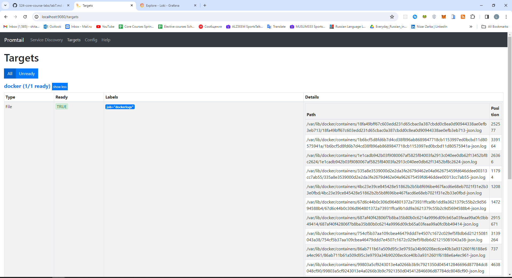
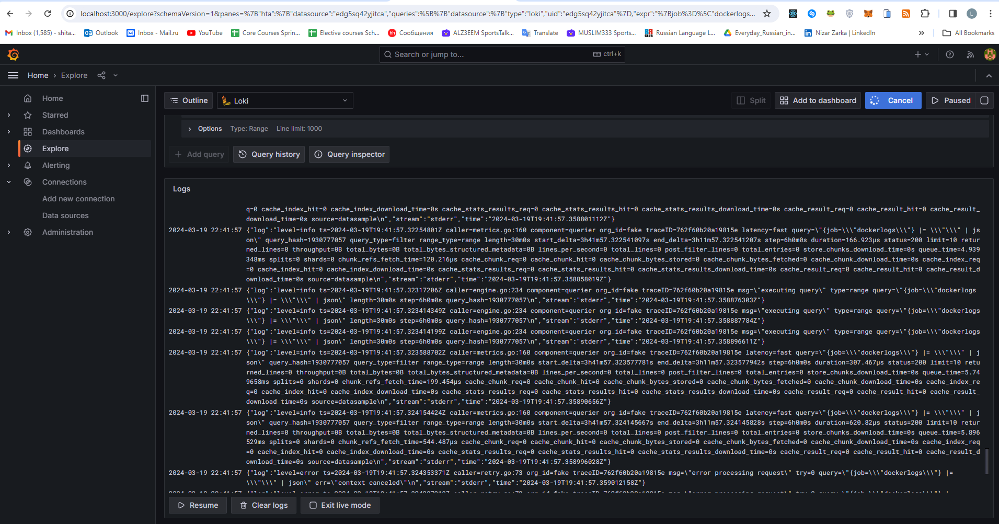
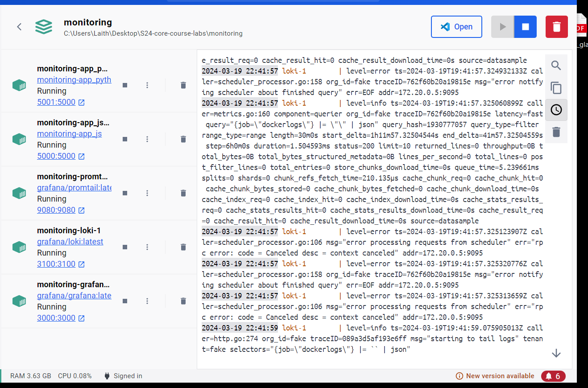

### Grafana

- Grafana is an open-source platform designed for observability and monitoring. No matter where your metrics are kept, you may query, visualize, receive alerts about, and comprehend them with its help. In our configuration, Grafana is used to visualize the logs that Loki has gathered.
- Connect using `http://localhost:3000`
### Loki

- Loki is a Prometheus-inspired multi-tenant, highly available, horizontally scalable log aggregation solution. It is made to be incredibly simple to use and economical. Loki gathers our apps' logs and indexes them.

- Available to Grafana inside Docker at `http://loki:3100`

## Promtail

- Promtail transfers local log information to a private Grafana Loki instance or Grafana Cloud. Generally, it is installed on all computers that execute applications that require oversight. Its main functions are target discovery, labeling log streams, and pushing log streams to the Loki instance.

## Setup

Two of these are included in our file `docker-compose.yml` `app_js` and `app_python`. The logging driver used by both programs is called `json-file`, and log files can have a maximum size of 300k and a maximum of 15 files.

## Bonus Task

We added an extra application to the `docker-compose.yml` configuration. In addition, we changed the configuration of the logging stack to gather logs from every container listed in the `docker-compose.yml`.

## Screenshots

### Promtail

### Grafana

### Loki

### Monitoring docker

